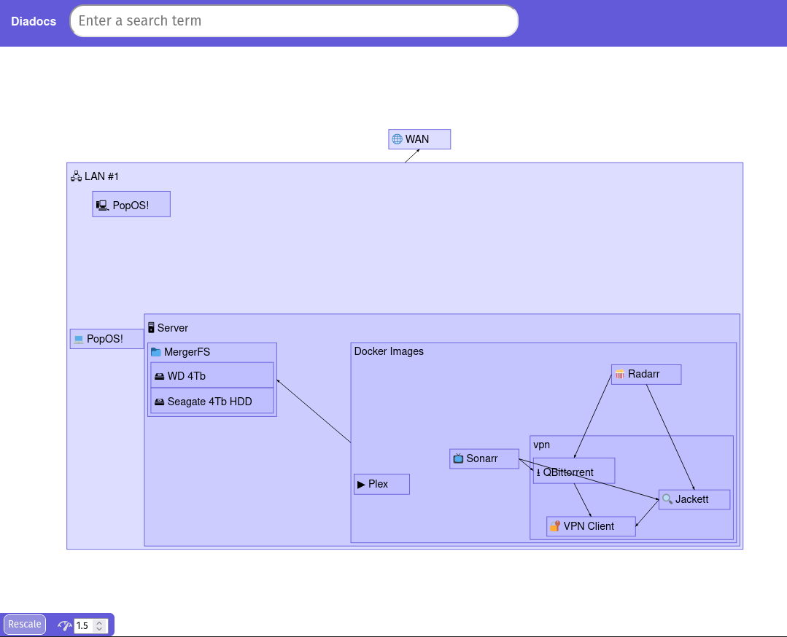
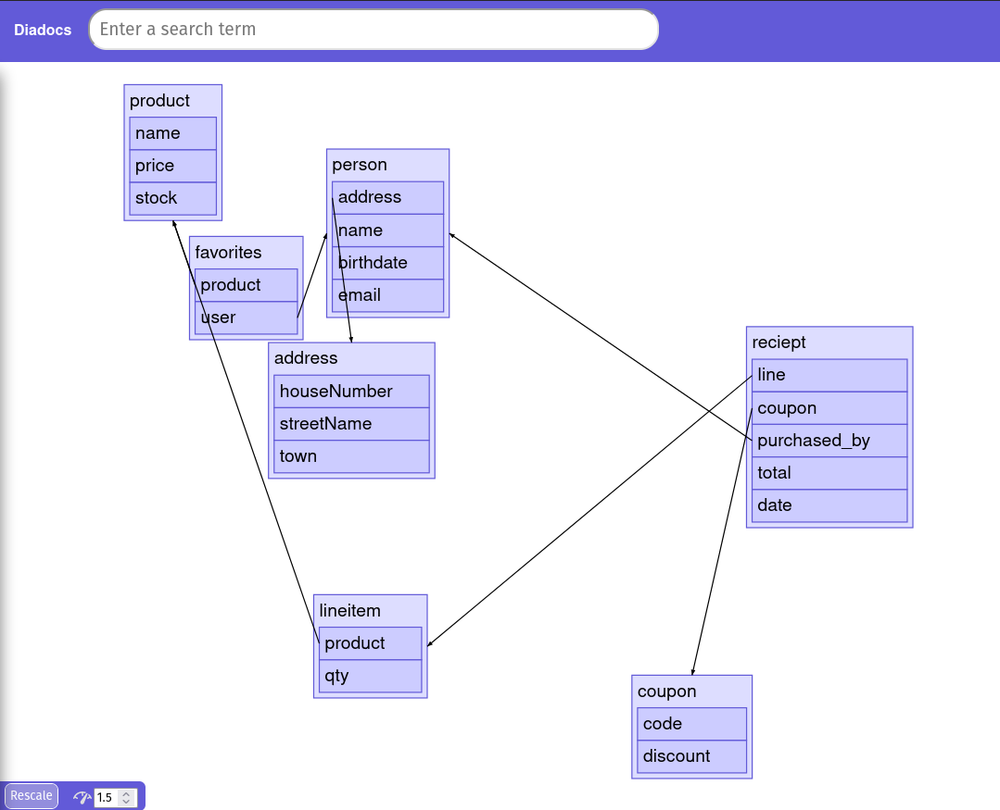
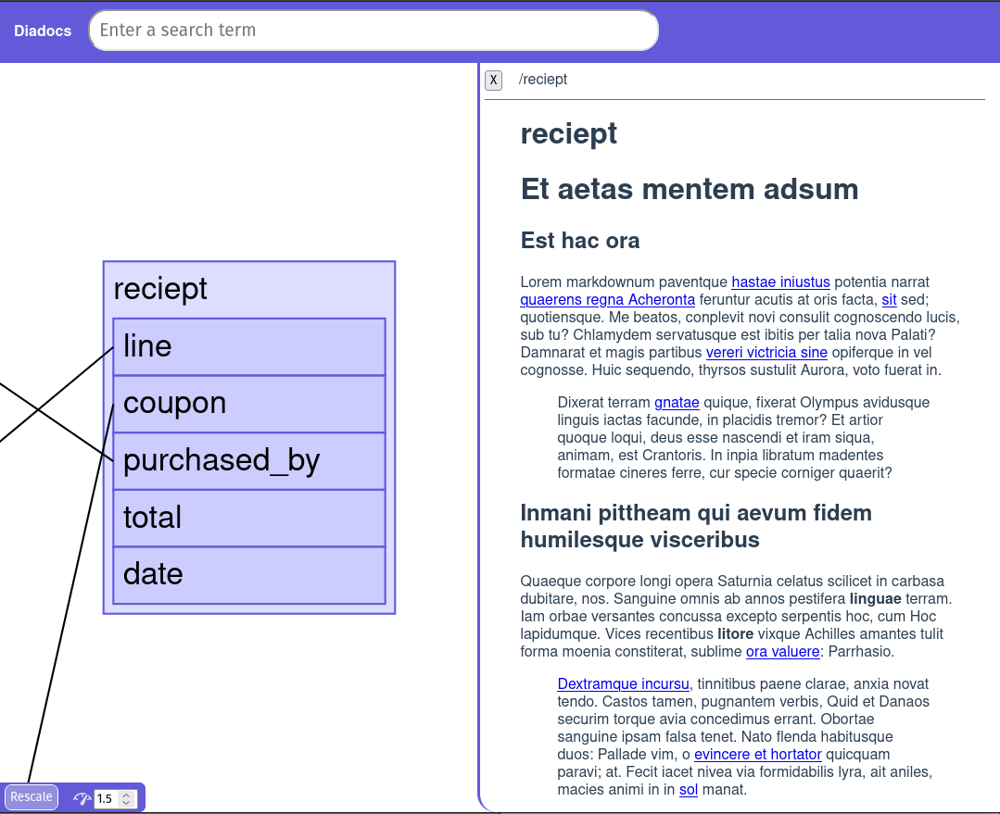
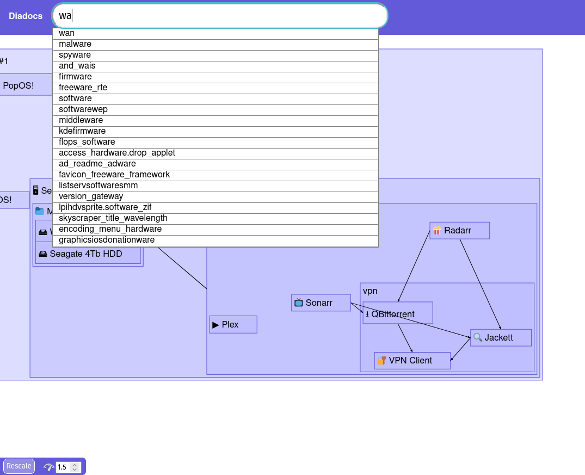
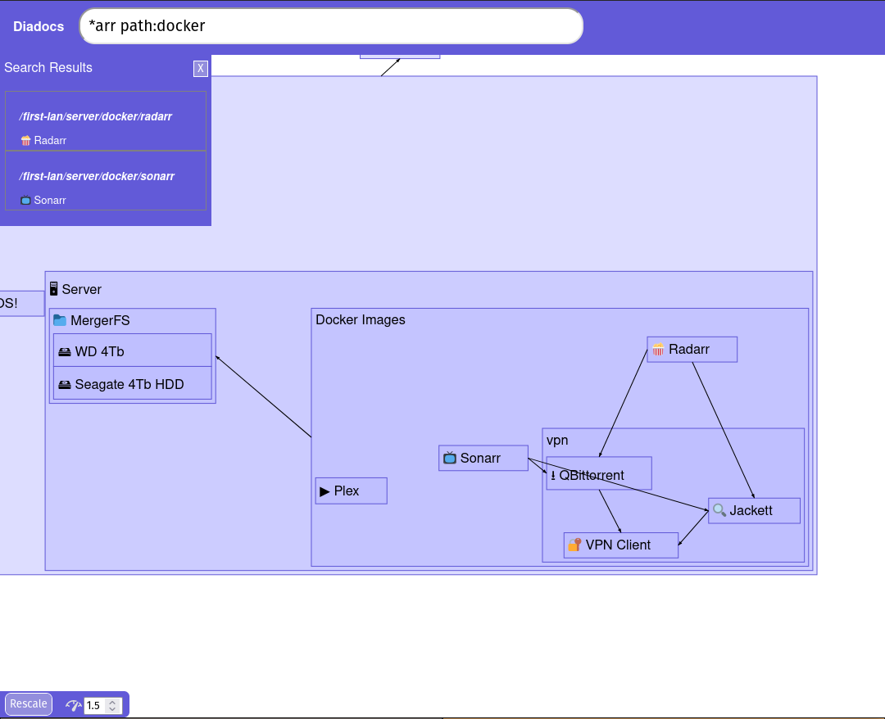

# Diadocs

Diadocs is a documentation tool to help convey complex ideas simply through visual form.

Features:
* Full text search of your documentation powered by [whoosh](https://whoosh.readthedocs.io/en/latest/querylang.html)
* Easy navigation, full pan/zoom support and customisable transition speed
* Full markdown support for all documentation
* Automated graphing and visualisation of your documentation
* Adjustable layout modes to change how the graph is rendered
* Easy docker-compose deployment

## Screenshots

### Flexible layout system

A basic /r/homelab inspired network, layed out in diadocs:



With `"layout": "stack"` we can make ourselves some table-like structures for a data dictionary.



### Easy navigation

Where clicking a table shows its documentation:



Suggestions provided based on the contents of the documentation:



And advanced search using [whoosh query syntax](https://whoosh.readthedocs.io/en/latest/querylang.html):



## Running diadocs

Running is easy with docker-compose.

Simply clone the repo locally
```
git clone https://github.com/jableader/datadic
```

Change into the dir
```
cd datadic
```

Run docker-compose:
```
docker-compose up -d
```

It'll automatically build and run the containers for you. Open http://localhost:8080/ to see.

## Todo

[ ] Images / Iconography for nodes
[ ] Tags
[ ] Node visibility
